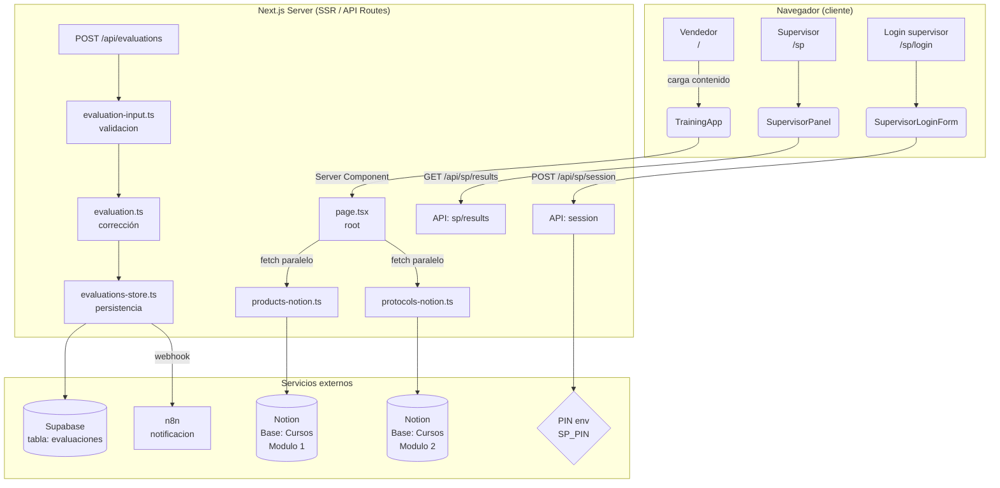
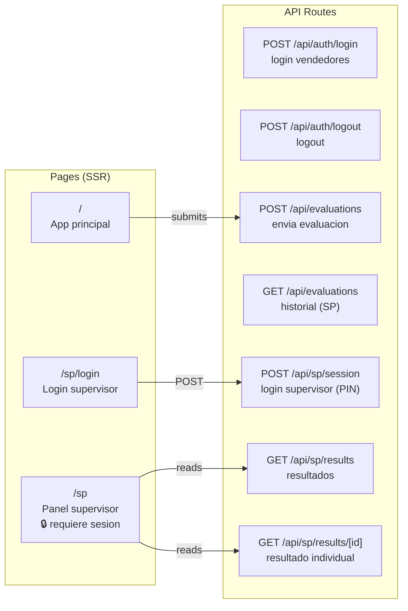
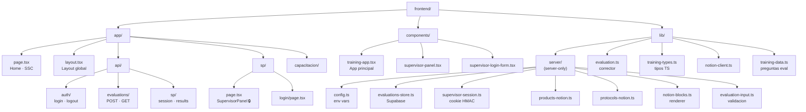
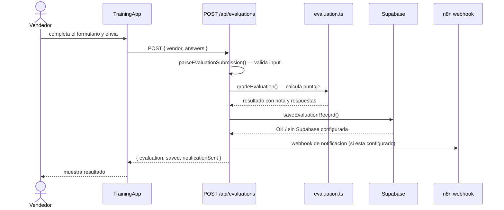
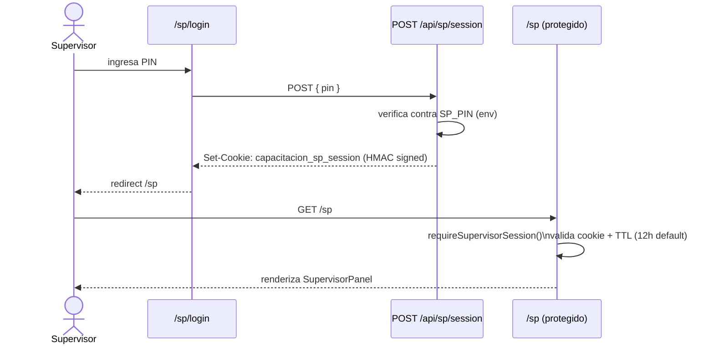

# Capacitacion Invierno - Frontend

Guia de excursiones, traslados y protocolos de venta para temporada de invierno.

## Objetivo

Este proyecto usa Notion como CMS.
El contenido operativo se edita en Notion y la app lo renderiza en tiempo real (sin hardcodear texto en codigo para los modulos de contenido).

---

## Infraestructura

### Stack tecnologico

| Capa | Tecnologia |
|---|---|
| Framework | Next.js 16 (App Router) |
| UI | React 19 + Tailwind CSS v4 |
| Lenguaje | TypeScript 5 |
| CMS | Notion API (`@notionhq/client`) |
| Base de datos | Supabase (evaluaciones) |
| Automatizacion | n8n (webhook de notificaciones) |
| Auth supervisor | Cookie HMAC-SHA256 (sin libreria externa) |

---

### Arquitectura general



---

### Rutas de la aplicacion



---

### Estructura de carpetas



---

### Flujo de una evaluacion



---

### Flujo de sesion supervisor



---

## Contenido en Notion

Base de datos unica:

- `NOTION_DATABASE_ID`: base `Cursos`

Separacion por modulo:

- `Modulo = "Modulo 1"`: productos (excursiones, traslados, clases)
- `Modulo = "Modulo 2"`: protocolos (7 secciones)

### Modulo 1 (Productos)

Cada producto vive en una pagina de Notion.

Propiedades principales:

- `OrdenID`
- `Nombre`
- `Tipo`
- `Proveedor`
- `Descripcion`
- `Horario`
- `Temporada`
- `PuntoEncuentro`
- `Diferencial`

Body de pagina (editable por humanos):

- `## Precios` -> tabla (Metodo | Precio)
- `## Incluye` -> bullets
- `## No incluye` -> bullets
- `## Adicional` -> bullets (opcional)
- `## Itinerario` -> parrafo (opcional)

### Modulo 2 (Protocolos)

Hay 7 paginas (una por seccion), identificadas por propiedad `Seccion`:

- `salesPriority`
- `clothingNotes`
- `providerAvailability`
- `availabilityChecklist`
- `paymentWarnings`
- `paymentRules`
- `fullPaymentSteps`

El contenido de cada seccion se toma del body (tablas, callouts, bullets o lista numerada segun corresponda).

## Variables de entorno

Crear `.env` con:

```dotenv
NOTION_TOKEN=tu_token_de_notion
NOTION_DATABASE_ID=tu_database_id
SP_PIN=pin_supervisor
SUPABASE_URL=...
SUPABASE_KEY=...
SUPABASE_SERVICE_ROLE_KEY=...
N8N_WEBHOOK_URL=...
```

## Desarrollo

```bash
npm install
npm run dev
```

App local:

- `http://localhost:3000`

## Comandos utiles

```bash
npm run lint
npx tsc --noEmit
npm run build
npm run start
```

## Verificacion de sincronizacion Notion

Durante la migracion se uso un script de auditoria (`/tmp/deep-verify.mjs`) para comparar Notion vs datos originales campo por campo.
Resultado actual: contenido alineado 100%.

Si queres repetir la auditoria, se puede volver a ejecutar:

```bash
node /tmp/deep-verify.mjs
```

## Flujo recomendado de contenido

1. Editar contenido en Notion.
2. Guardar cambios en las paginas correspondientes.
3. Refrescar la app para validar render.
4. Ejecutar chequeo tecnico (`npx tsc --noEmit` y `npm run lint`) antes de desplegar.
